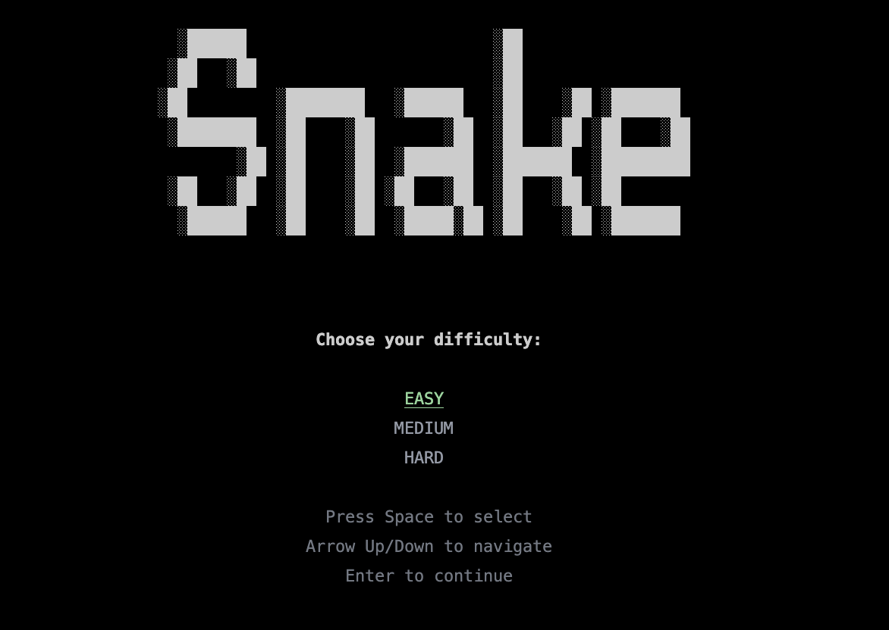
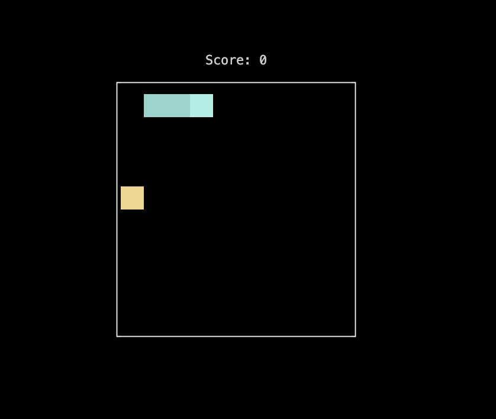
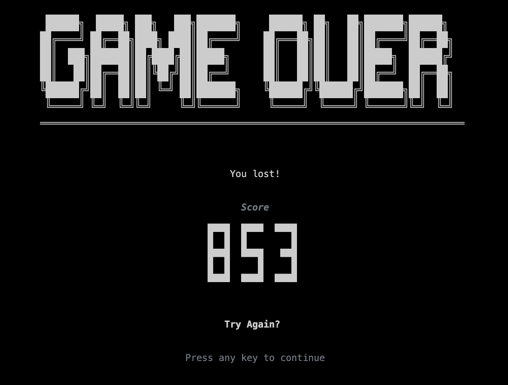

# 🐍 Snake

A classic Snake game for the terminal, built with Dart and [nocterm](https://pub.dev/packages/nocterm).

```
  ░██████                         ░██
 ░██   ░██                        ░██
░██         ░████████   ░██████   ░██    ░██ ░███████
 ░████████  ░██    ░██       ░██  ░██   ░██ ░██    ░██
        ░██ ░██    ░██  ░███████  ░███████  ░█████████
 ░██   ░██  ░██    ░██ ░██   ░██  ░██   ░██ ░██
  ░██████   ░██    ░██  ░█████░██ ░██    ░██ ░███████
```

<p align="center">
    
    
    
</p>

## Getting Started

### Prerequisites

- Dart SDK `>=3.9.0 <4.0.0`

### Run the Game

```bash
dart run
```

## How to Play

1. **Select a difficulty** using the arrow keys and press Enter
2. **Control the snake** with the arrow keys:
   - `↑` Move up
   - `↓` Move down
   - `←` Move left
   - `→` Move right
3. **Eat the food** to grow and score points
4. **Avoid** running into yourself!

## Difficulty Levels

| Difficulty | Grid Size | Speed  |
| ---------- | --------- | ------ |
| Easy       | 10×10     | Slow   |
| Medium     | 15×15     | Medium |
| Hard       | 20×20     | Fast   |
